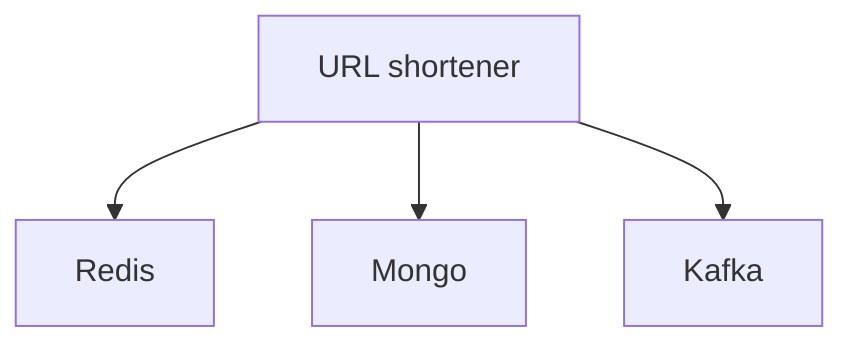

# URL Shortener

### Diagrama

```mermaid
flowchart TD
    a1[URL shortener]
    a2[Redis]
    a3[Mongo]
    a4[Kafka]

    a1 --> a2
    a1 --> a3
    a1 --> a4
```


### run app

```sh
make run
```

### Run unite tests

```sh
make test
```

### Run linter

```sh
make lint
```
